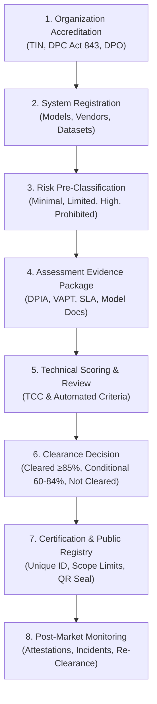

# National AI Project Tracking and Clearance System (NAPTCS)

A national platform to register, assess, clear, and monitor Artificial Intelligence projects across Ghana — covering both **Government Entities (MDAs, MMDAs, SOEs)** and the **Private Sector (Commercial Enterprises, Startups, and Foreign Vendors)**.

---

## 🏛️ Purpose & Scope (NAPTCS Scope of Work)

The **National AI Project Tracking and Clearance System (NAPTCS)** gives the regulator (NITA / ITCO / Clearance Authority) a single source of truth and gives AI project owners a predictable, transparent path to statutory approval pursuant to Ghana's **Data Protection Act, 2012 (Act 843)**, the **Cybersecurity Act, 2020 (Act 1038)**, the **EU AI Act**, **NIST AI RMF**, and **ISO/IEC 42001**.

### Core Objectives
- **Complete National Inventory**: Catalog every AI system in Ghana, whether government-led, private sector, or an international partnership.
- **Organization Clearance Gatekeeper**: **Strict Requirement** — An organization (MDA, MMDA, SOE, or private firm) must first submit statutory credentials (GRA TIN, DPC Act 843 registration, designated Data Protection Officer, sovereign hosting guarantees) and be accredited before its AI projects or geospatial telemetry appear on the system.
- **Risk Pre-Classification & Evidence Packaging**: Classify systems into 4 tiers (*Minimal*, *Limited*, *High*, *Prohibited*). High-risk systems must submit executed DPIAs, VAPT cybersecurity pen-test audits, model data lineage cards, and bias audits.
- **Automated & Committee Clearance Scoring**: Clear systems based on weighted thresholds (*Cleared ≥ 85%*, *Conditional 60–84%*, *Not Cleared < 60%*) with mandatory gate overrides (e.g. no DPIA on a high-risk project causes an automatic block).
- **Public Verification & Transparency Portal**: Allows citizens, institutions, and international partners to authenticate any clearance certificate via unique identifier or QR link, with sensitive security data redacted under Act 843.

---

## 🔄 The 8-Stage Clearance Lifecycle

NAPTCS enforces an immutable 8-stage lifecycle for all artificial intelligence systems:



---

## 🚀 Interactive Modules

The NAPTCS Single Page Application is built with **React, TypeScript, and Vite**, featuring a modern sovereign UI with rich micro-animations, glassmorphism, and responsive workflows:

1. **NAPTCS Analytics & M&E Dashboard**: Dual-sector KPI counters, clearance funnel statistics, risk tier breakdown, budget absorption by entity, and live regulatory notices.
2. **Organization Clearance (The Gatekeeper Engine)**: Review accreditation requests from MDAs, SOEs, and private technology firms. One-click vetting unlocks or quarantines an organization's projects across the entire national portal.
3. **AI Projects Registry**: Dual-track registry browser (Government vs Private Sector) with risk pre-classification wizards, mandatory evidence checklist gates, and Regulator clearance adjudication tools.
4. **Public Verification Portal (SOW Section 5.7)**: Real-time certificate lookup tool for citizens and partners to verify clearance certificates (e.g., `NAPTCS-CLR-2026-001`), display permitted operational scope, check conditional deadlines, and browse the public register of cleared AI systems.
5. **GIS Spatial Monitoring & Telemetry Map**: Leaflet.js PostGIS geospatial engine tracking AI systems across all 16 regions of Ghana, featuring:
   - Sector Track filtering (Government vs Private Sector).
   - Gatekeeper Clearance filtering (Cleared & Public Only vs Show Quarantined).
   - Live IoT Edge Telemetry Mesh (Akosombo Dam, Cocoa Board, Kumasi traffic, drone vertiports).
   - Interactive GIS Spatial API Console (cURL generation, GeoJSON RFC 7946, PostGIS queries).
   - Multi-format spatial export (GeoJSON, CSV, KML).
6. **Governance & Ethics (Act 843)**: Multi-dimensional scorecard calculating National Governance Scores across Fairness, Transparency, Accountability, Privacy, and Security.
7. **AI Readiness Maturity Wizard**: 5-pillar maturity assessment evaluating institutional capacity, computing infrastructure, sovereign data pipelines, and policy readiness.
8. **Risk Matrix & Tiers**: 5x5 Likelihood vs Impact threat matrix mapping critical vulnerabilities to operational mitigations.
9. **Document Vault & Full-Text OCR**: Sovereign object storage simulation with document versioning, digital signatures, and OCR keyword indexing.
10. **Regulator AI Assistant**: Natural language conversational assistant grounded in Ghana Act 843, Act 1038, and national AI policies.

---

## 👥 Stakeholders & Roles

The system supports role-based access control (RBAC) scoped by institution:
- **Regulator / Clearance Authority**: Final approval, policy configuration, certificate issuance, and sovereign oversight.
- **Technical Review Committee (TCC)**: Technical assessment, model audit, and conformity decisions.
- **Government Applicant (MDA/MMDA/SOE)**: Register and manage public sector AI initiatives.
- **Private Sector Applicant**: Register private technology firms, commercial AI products, and COTS/SaaS systems.
- **Auditor**: Read-only oversight with complete historical audit trail.
- **Public User**: Access to public verification portal, cleared project register, GIS spatial map, and AI chat assistant.

---

## ⚡ Running Locally

```bash
# 1. Install dependencies
npm install

# 2. Launch development server
npm run dev

# 3. Build for production (TypeScript + Vite bundle)
cmd /c npm run build
```

---

## 📜 Legislative Framework
- **Ghana Data Protection Act, 2012 (Act 843)**: Mandatory registration of data controllers, DPIAs for high-risk processing, and sovereign data residency.
- **Cybersecurity Act, 2020 (Act 1038)**: Protection of Critical Information Infrastructure (CII) and mandatory incident reporting.
- **International Benchmarks**: Aligned with the **EU AI Act** (risk-based approach), **NIST AI Risk Management Framework (RMF)**, and **ISO/IEC 42001** (AI Management Systems).
