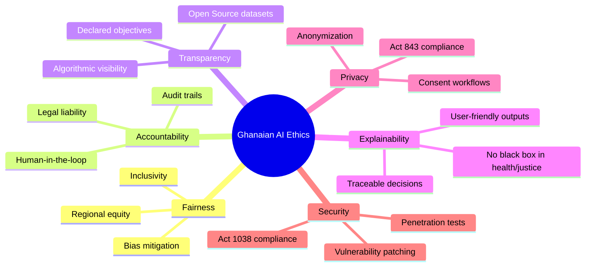

# National AI Governance & Ethics Framework: GNAPRMS

This framework defines the AI Governance criteria, ethical scoring matrices, regulatory checks, and organizational maturity scales established for the **Ghana National AI Projects Registry & Monitoring System (GNAPRMS)**.

---

## 1. The Six Pillars of Ghanaian AI Ethics

To ensure that AI initiatives in Ghana benefit all citizens without inducing bias, privacy infringement, or security concerns, all registered systems are assessed against six core ethical dimensions:



1. **Fairness**: AI models must not discriminate based on tribe, region, language, gender, religion, or economic class.
2. **Accountability**: Every AI initiative must have a designated human operator (DHO) and an overseeing ministry held legally responsible for outcomes.
3. **Transparency**: Algorithms must document model architectures, training datasets, and intent.
4. **Explainability**: Complex neural networks (especially in healthcare and justice) must provide a non-technical breakdown explaining how outcomes were derived.
5. **Privacy**: Systems must adhere strictly to the **Data Protection Act, 2012 (Act 843)**, ensuring citizen records are anonymized and consent-driven.
6. **Security**: AI applications must withstand cyber threats, undergoing routine pen testing under the **Cybersecurity Act, 2020 (Act 1038)**.

---

## 2. Dynamic Governance Scorecard Methodology

Each project undergoes an audit by M&E officers and auditors, generating scores from `0` to `100` across the six ethical pillars. The **National AI Governance Score (NGS)** is computed as a weighted average:

$$\text{NGS} = w_1 F + w_2 A + w_3 T + w_4 E + w_5 P + w_6 S$$

Where the weights $w_i$ reflect priority sectors (e.g., healthcare and finance place heavier weight on security and privacy; public dashboards prioritize transparency):

* **F (Fairness)**: Weight = 0.20
* **A (Accountability)**: Weight = 0.15
* **T (Transparency)**: Weight = 0.15
* **E (Explainability)**: Weight = 0.10
* **P (Privacy)**: Weight = 0.20
* **S (Security)**: Weight = 0.20

### Compliance Grades & Risk Bands

Based on the calculated NGS, the project is classified into a compliance tier:

> [!NOTE]
> **NGS: 90% - 100% | Grade: Excellent**
> The project conforms to all local ethical guidelines, utilizes state-of-the-art fairness constraints, and holds complete data audit records. Safe for national deployment.

> [!TIP]
> **NGS: 75% - 89% | Grade: Good**
> Satisfies all core requirements, but lacks open-source datasets or requires slight improvements in non-technical explainability interfaces.

> [!WARNING]
> **NGS: 50% - 74% | Grade: Moderate**
> Project contains notable gaps (e.g., weak anonymization protocols or lack of third-party pen-tests). Requires mandatory review before pilot stages.

> [!CAUTION]
> **NGS: < 50% | Grade: High Risk**
> Significant risk of bias, citizen data exposure, or system compromise. Production licenses are suspended, and immediate technical mitigation is required.

---

## 3. Institutional AI Readiness & Maturity Levels

Before government institutions (MDAs/MMDAs) implement AI solutions, their organizational readiness is evaluated across 5 key areas:
1. **Infrastructure**: GPU clusters, cloud storage, local servers.
2. **Skills**: Data scientists, machine learning engineers, and software operators on staff.
3. **Data Availability**: Structured, high-quality, and accessible database registers.
4. **Funding**: Dedicated budgetary resources for system maintenance and operation.
5. **Governance**: Appointed Data Protection officers and active compliance staff.

### Maturity Level Thresholds

```text
Level 1: Initial (Score 0-25%)
- Minimal data architecture; zero machine learning skills; AI projects handled on ad-hoc contract terms without governance oversight.

Level 2: Defined (Score 26-50%)
- Basic digital registries exist; IT staff understand AI foundations; pilot programs are planned; basic data guidelines followed.

Level 3: Managed (Score 51-75%)
- Dedicated data science departments; standardized computational resources; active ethics review checklists; models are monitored.

Level 4: Optimized (Score 76-100%)
- Complete pipeline automation; real-time bias tracking; institutional cross-collaboration; international standard compliance (ISO 42001).
```
