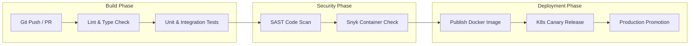

# DevOps, CI/CD & Deployment Architecture: GNAPRMS

This document outlines the DevOps processes, containerization layers, Kubernetes orchestration plans, continuous integration (CI/CD) pipelines, and system monitoring systems designed for the **Ghana National AI Projects Registry & Monitoring System (GNAPRMS)**.

---

## 1. Containerization & Development Setup

The platform uses containerization to ensure consistency across local development, staging, and production environments. Below is a production-grade `docker-compose.yml` defining the central components of the GNAPRMS workspace.

### Core Services Stack: `docker-compose.yml`

```yaml
version: '3.8'

services:
  # Primary Relational Database
  postgres:
    image: postgres:15-alpine
    container_name: gnaprms-postgres
    restart: always
    environment:
      POSTGRES_USER: gnaprms_admin
      POSTGRES_PASSWORD: SecurePassword2026!
      POSTGRES_DB: gnaprms_registry
    ports:
      - "5432:5432"
    volumes:
      - pgdata:/var/lib/postgresql/data
    healthcheck:
      test: ["CMD-SHELL", "pg_isready -U gnaprms_admin -d gnaprms_registry"]
      interval: 10s
      timeout: 5s
      retries: 5

  # Document and Risk Ledger NoSQL Store
  mongodb:
    image: mongo:6.0
    container_name: gnaprms-mongodb
    restart: always
    environment:
      MONGO_INITDB_ROOT_USERNAME: mongo_admin
      MONGO_INITDB_ROOT_PASSWORD: MongoSecurePassword2026!
    ports:
      - "27017:27017"
    volumes:
      - mongodata:/data/db

  # Document Storage Service (S3 Compatible)
  minio:
    image: minio/minio:RELEASE.2023-05-18T00-12-52Z
    container_name: gnaprms-minio
    restart: always
    ports:
      - "9000:9000"
      - "9001:9001"
    environment:
      MINIO_ROOT_USER: minio_admin
      MINIO_ROOT_PASSWORD: MinioSecurePassword2026!
    volumes:
      - miniodata:/data
    command: server /data --console-address ":9001"

  # Caching and Session Token Manager
  redis:
    image: redis:7-alpine
    container_name: gnaprms-redis
    restart: always
    ports:
      - "6379:6379"
    volumes:
      - redisdata:/data

  # API Gateway
  kong:
    image: kong:3.3
    container_name: gnaprms-gateway
    restart: always
    environment:
      KONG_DATABASE: "off"
      KONG_DECLARATIVE_CONFIG: /usr/local/kong/kong.yml
      KONG_PROXY_LISTEN: 0.0.0.0:8000, 0.0.0.0:8443 ssl
    ports:
      - "8000:8000"
      - "8443:8443"
    volumes:
      - ./kong.yml:/usr/local/kong/kong.yml

volumes:
  pgdata:
  mongodata:
  miniodata:
  redisdata:
```

---

## 2. Kubernetes Orchestration Plan

For high availability in a national setting, GNAPRMS is orchestrated using **Kubernetes (K8s)**. 

* **Cluster Topology**: Three master nodes (control plane) and a minimum of four worker nodes spanning separate availability zones.
* **Namespaces Partitioning**:
  * `gnaprms-core`: Registry service, Auth service, UI frontend.
  * `gnaprms-data`: PostgreSQL StatefulSet, MongoDB cluster, Redis cache.
  * `gnaprms-sec`: Kong Gateway, Vault secrets manager.
* **Auto-Scaling (HPA)**: Pod instances are auto-scaled dynamically using Horizontal Pod Autoscalers targeting a benchmark threshold:
  `Metric: CPU Utilization > 75% OR Memory Utilization > 80%`
* **Pod Disruptions**: Configured with a `PodDisruptionBudget` enforcing a minimum of 2 active replicas per microservice, achieving 99.99% uptime guarantees.

---

## 3. Continuous Integration & Deployment (CI/CD)

The CI/CD pipeline automates validation, building, security scans, and production deployments.

### Delivery Lifecycle



* **SAST Analysis**: Code is run through static analysis tools (e.g., SonarQube) before merging, ensuring compliance with clean coding conventions and denying security patterns (like SQL injections, open CORS, or hardcoded API keys).
* **Canary Strategy**: Production releases use a canary deployment structure. The API Gateway shifts 5% of web requests to the new service version, scaling up to 100% over a 4-hour window if error rates stay below 0.01%.

---

## 4. Monitoring, Logging & Observability

Observability tracks system performance, network utilization, and security incidents.

1. **Metrics Ingestion (Prometheus & Grafana)**:
   * Prometheus pulls numeric metrics from all microservice endpoints (`/metrics`) and database adapters.
   * Grafana panels visualize RAM consumption, request rates, network latency, database connection pools, and event message backlog.
2. **Centralized Log Management (FluentBit & Elasticsearch)**:
   * **FluentBit** daemon-sets run on each Kubernetes worker node to ingest stdout/stderr logs from all running pods.
   * Logs are parsed, labeled, and forwarded to an **Elasticsearch** cluster.
   * Administrators search and trace errors using **Kibana** boards.
3. **Alerting System**:
   * Critical alerts (e.g., "PostgreSQL replica synchronization failed", "Memory utilization exceeded 95%", "Failed admin logins spiked") are routed to Slack hooks and standard SMS alerts to standby DevOps personnel.
