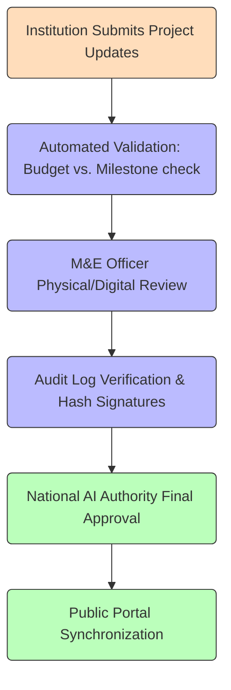

# National AI Monitoring & Evaluation (M&E) Framework: GNAPRMS

This document establishes the Monitoring & Evaluation (M&E) indicators, key performance indicators (KPIs), socio-economic impact metrics, data verification workflows, and standard reporting structures for the **Ghana National AI Projects Registry & Monitoring System (GNAPRMS)**.

---

## 1. Core National AI Performance Indicators

To measure the health and progress of Ghana's digital transformation agenda, M&E officers track ten primary national KPIs on the main administrative dashboard:

1. **Total Registered AI Projects**: Absolute count of registered initiatives across all MDAs, private entities, and startups.
2. **Active vs. Delayed Ratio**: The proportion of projects progressing according to planned timelines versus those hitting critical milestone delays.
3. **National AI Readiness Index (NARI)**: Weighted average of the AI readiness scores computed across all active public institutions.
4. **Socio-Economic Impact Score (SEIS)**: Metric measuring cost savings and public efficiency gains driven by deployed AI.
5. **National AI Governance Compliance Rate**: Percentage of registered projects that achieve an "Excellent" or "Good" ethical grade.
6. **Sectoral Concentration Index (SCI)**: Measures project density across vital sectors (Health, Agriculture, Education) to prevent clustering.
7. **Regional Project Density**: Tracks GIS distributions to ensure AI benefits reach rural districts beyond the Greater Accra and Ashanti hubs.
8. **Budget Disbursed-to-Utilized Ratio**: Visualizes funding efficiency and prevents capital stagnation or overruns.
9. **Citizen Benefit Reach**: Estimates the total population directly using or impacted by registered AI systems.
10. **Academic & Research Collaborations**: Tracks the number of projects co-developed with local universities (e.g., University of Ghana, KNUST, Ashesi).

---

## 2. Socio-Economic Impact Scorecard

The platform calculates the **Socio-Economic Impact Score (SEIS)** of projects in operational or completed stages based on three key pillars:

### A. Economic Impact (35% weight)
* **Cost Savings Indicator (CSI)**: Percentage decrease in ministerial operating expenses compared to manual procedures.
* **Efficiency Gains**: Measured in average processing time reductions (e.g., minutes per service request before/after AI integration).
* **Return on Investment (ROI)**:
  $$\text{ROI} = \frac{\text{Net Financial Value Generated} - \text{Total Disbursed Budget}}{\text{Total Disbursed Budget}} \times 100$$

### B. Social Impact (35% weight)
* **Citizen Accessibility**: Evaluates if the AI supports local languages (e.g., Twi, Ga, Ewe) or offers offline interfaces for remote areas.
* **Job Creation/Upskilling**: The count of local IT specialists and administrators hired, upskilled, or certified to run the model.
* **Regional Inclusion**: Ensures projects are deployed or tailored to rural municipal assemblies (MMDAs).

### C. Innovation & Intellectual Property (30% weight)
* **Local Code Ownership**: Percentage of algorithms trained, customized, or owned locally within Ghana versus proprietary foreign licensing.
* **Academic Integrations**: Active student internships, dataset releases, or published papers linked to the project.

---

## 3. Data Verification & Audit Workflows

To prevent false reporting, GNAPRMS implements a multi-step data verification lifecycle:

1. **Digital Evidence Collection**: Project Managers must upload concrete evidence (e.g., Github repositories, functional links, system logs, stakeholder signature letters) when moving a project's milestone from "Planning" to "Deployment".
2. **On-Site Spatial Verifications**: Regional M&E officers use the **GNAPRMS Mobile Application** to record geo-tagged and timestamped photographs of physical installations (such as smart irrigation rigs in agricultural regions or diagnostic screens in rural health clinics) which are matched against the system coordinates.
3. **Independent Compliance Reviews**: Ministry auditors conduct semi-annual reviews, comparing MongoDB transaction logs with PostgreSQL registry states to flag discrepant budgets or milestones.

---

## 4. Reporting Schedules & Formats

* **Quarterly National AI Status Reports**: Automatically generated PDF and PowerPoint exports containing aggregated sector graphs, budget utilizations, and list of high-risk projects. Distributed directly to the Office of the President and Ministry of Communications and Digitalisation.
* **Annual Public AI Transparency Dashboard**: Open-data JSON and CSV exports summarizing approved projects, locations, and impact metrics to promote accountability and civil engagement.
