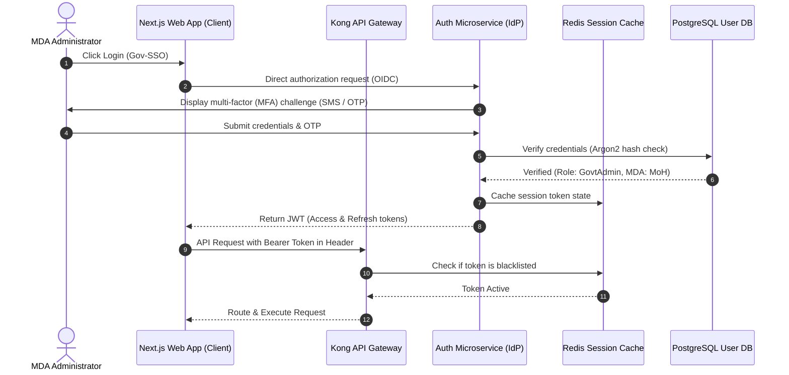

# Security Architecture & Data Compliance: GNAPRMS

This document outlines the Security Architecture, access control models, cryptographic controls, and legislative compliance mapping for the **Ghana National AI Projects Registry & Monitoring System (GNAPRMS)**.

---

## 1. Authentication & Single Sign-On (SSO)

GNAPRMS enforces a centralized, modern identity system leveraging **OAuth 2.0** and **OpenID Connect (OIDC)**. The system is designed to integrate with the Ghanaian Government Single Sign-On (Gov-SSO) portal.

### Authentication Protocol Flow

### Key Controls
* **JWT Token Lifespan**: Access tokens expire in 15 minutes. Refresh tokens expire in 8 hours and utilize rotation (every refresh generates a new refresh token).
* **Multi-Factor Authentication (MFA)**: Enforced for all administrative and auditing roles. Supported via TOTP (Authenticator App) or local SMS gateways using encrypted, single-use, 6-digit verification codes expiring in 3 minutes.
* **Brute-Force Protection**: Enforced at the Kong API Gateway layer using IP-based and username-based rate limiting (maximum 5 failed login attempts in 10 minutes triggers temporary block).

---

## 2. Authorization Models: RBAC & ABAC

To ensure granular security across multiple ministries and districts, the platform implements a hybrid **Role-Based Access Control (RBAC)** and **Attribute-Based Access Control (ABAC)** mechanism.

### A. Role-Based Matrix (RBAC)

The system maps capabilities to specific roles:

| Role | Scope | Permitted Actions |
| :--- | :--- | :--- |
| **Super Administrator** | Global | Configure system, manage users, override policy, view audit logs |
| **National AI Authority** | Global | Review all national AI initiatives, run analytics, audit compliance |
| **Government Administrator** | Sector / Ministry | Manage institutional workflows, approve submissions, pull sector reports |
| **Institution Administrator** | Institutional | Register new AI projects, manage local milestones and budgets |
| **Project Manager** | Assigned Project | Update milestones, log risks, upload progress documents |
| **M&E Officer** | Region / Sector | Perform audits, update KPI scores, log geospatial coordinates |
| **Auditor** | Global | Read-only access to projects, budgets, and compliance scorecards |
| **Public User** | Public | Read-only access to approved public projects, map, and national dashboards |

### B. Attribute-Based Rules (ABAC)

ABAC layers fine-grained data visibility boundaries:
* **Ministerial Boundary**: An *Institution Administrator* from the *Ministry of Health (MoH)* can only read/write projects where the project attribute `mda_owner == 'MoH'`. They cannot access projects owned by the *Ministry of Food and Agriculture (MoFA)*.
* **Geospatial Boundary**: Regional *M&E Officers* can only log milestone inspections for projects situated in their designated geographical attribute:
  `Rule: ALLOW UPDATE WHERE user.assigned_region == project.location_region`
* **Data Classification Boundary**: Public projects require an explicit attribute `is_public_approved == true`. Public users cannot access draft, conceptual, or classified security projects.

---

## 3. Cryptographic Controls & Data Protection

All data stores and communication channels enforce modern cryptographic protocols:

1. **Encryption in Transit**: Enforced using TLS 1.3 across all endpoints. Weak ciphers (such as RC4, 3DES, MD5) are disabled at the Gateway.
2. **Encryption at Rest**:
   * **Database Layers**: PostgreSQL tables are encrypted at rest using transparent data encryption (TDE) via AWS KMS or Docker-native volume encryption utilizing **AES-256-XTS**.
   * **Document Store**: Document uploads inside the S3 bucket are encrypted server-side with unique data keys managed by a hardware security module (HSM) under **AES-256-GCM**.
3. **Database Hashing**: Password hashes are computed using **Argon2id** (configured with a memory factor of 64MB, time cost of 3 iterations, and parallelism of 4 threads).

---

## 4. Compliance with Ghanaian Legislation

As a national government platform, GNAPRMS directly adheres to primary local legislative mandates:

### A. Data Protection Act, 2012 (Act 843)
* **Data Minimization**: Project forms collect only technical and organizational contact metrics; no unnecessary personally identifiable information (PII) of citizens is collected.
* **Data Subject Consent**: Institutional project teams sign formal electronic consent declarations regarding metadata publication.
* **Cross-Border Restrictions**: All production PostgreSQL databases and MinIO object stores are physically hosted on sovereign cloud servers located inside Ghana's borders to prevent unauthorized overseas processing.

### B. Cybersecurity Act, 2020 (Act 1038)
* **Critical National Information Infrastructure (CNII)**: Under Act 1038, the AI registry is classified as a CNII system. This mandates standard vulnerability disclosure pipelines and direct connection to the National Computer Emergency Response Team (CERT-GH).
* **Immutable Audit Trail**: All database edits trigger database-level triggers that append immutable, append-only logs to MongoDB, capturing the precise timestamp, operator, IP address, and schema diff. These logs cannot be deleted or modified, even by the Super Administrator.
