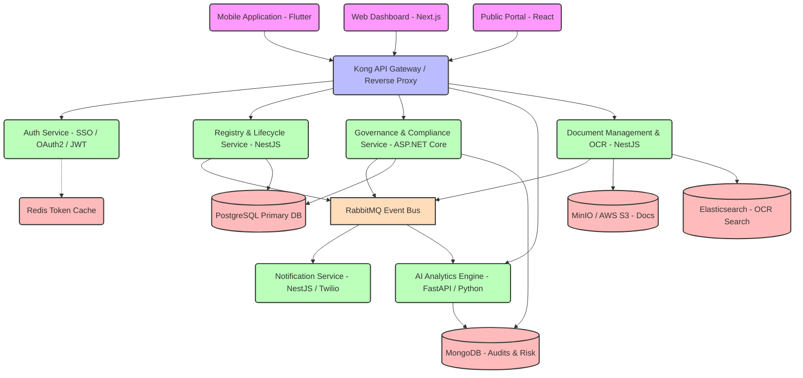

# Enterprise System Architecture: GNAPRMS

This document outlines the Enterprise Software Architecture for the **Ghana National AI Projects Registry & Monitoring System (GNAPRMS)**, demonstrating a highly scalable, available, resilient, and secure microservices design.

---

## 1. High-Level Architecture Overview

The system is designed with a **Microservices Architecture** utilizing event-driven communication to ensure high availability, horizontal scaling, and isolated domain boundaries. The backend is powered by a mixture of **NestJS** (for rapid API development, WebSockets, and integration layers) and **ASP.NET Core** (for high-throughput audit, compliance validation, and heavy analytics engines), integrated with an **API Gateway** and an **Event Bus**.

### Architectural Topology

---

## 2. Component Design & Microservice Directory

### A. Kong API Gateway
Acts as the single entry point for all frontend apps (Web, Mobile, Public Portal). It handles:
* **Rate Limiting**: Protects downstream microservices from DDoS or scraper bots.
* **SSL Termination**: Terminates TLS 1.3 certificates.
* **Routing**: Inspects incoming HTTP path prefixes and forwards requests (e.g., `/api/v1/projects` to Registry Service, `/api/v1/ocr` to Document MS).
* **CORS & Security Headers**: Enforces strict browser-level security policies.

### B. Auth Service (NestJS)
Integrated with a centralized Government Single Sign-On (SSO):
* Generates stateless, cryptographically signed JSON Web Tokens (JWT) containing Roles and Permissions (RBAC/ABAC).
* Uses **Redis** to blacklist revoked tokens (e.g., on logout or role changes).
* Enforces Multi-Factor Authentication (MFA) via SMS (Ghana's local SMS API gateways) or TOTP (Google Authenticator).

### C. Registry & Lifecycle Service (NestJS)
Manages the core AI projects lifecycle (Concept, Planning, Development, Pilot, Deployment, etc.).
* Exposes a fast RESTful API and GraphQL endpoints.
* Handles transactional database entries inside **PostgreSQL**.
* Publishes lifecycle state-change events (e.g., `PROJECT_REGISTERED`, `STAGE_UPDATED`) to **RabbitMQ**.

### D. Governance & Compliance Service (ASP.NET Core)
A highly secure, performant C# backend focused on verifying AI projects against regulatory guidelines:
* Tracks compliance scores according to local and international frameworks (Ghana Data Protection Act, Cyber Security Act, and National AI Policy).
* Triggers compliance flags when projects skip ethical impact assessments.
* Stores compliance reports, checklist audits, and historical scores in PostgreSQL.

### E. Document Management & OCR Service (NestJS)
A high-throughput service dedicated to tracking project contracts, technical papers, and proposals:
* Files are uploaded directly to S3-compatible object storage (**MinIO** or **AWS S3**) with pre-signed URLs to reduce Gateway bandwidth.
* Extracts text from PDFs using **Tesseract OCR** background workers.
* Indexes extracted text in **Elasticsearch** for rapid full-text search across documents.

### F. AI Analytics Engine (FastAPI & Python)
Python-based microservice that leverages Machine Learning models:
* Predicts project success rates, budget overruns, and expected delay margins using **Scikit-learn** algorithms.
* Provides semantic clusters of projects to identify collaborations and reduce duplicated efforts.
* Connects directly to **MongoDB** to ingest unstructured data points and feed the AI recommendation engine.

---

## 3. Communication Patterns

### Synchronous Requests (HTTP/REST or gRPC)
* Used for user-facing actions that require immediate feedback:
  * Authentication and session setup.
  * Form submissions (Registry entries).
  * Direct document downloads.
  * Internal inter-service communications requiring transactional integrity are routed via **gRPC** to ensure sub-millisecond network latency and strongly-typed Protocol Buffers.

### Asynchronous Event-Driven Messaging (RabbitMQ)
* Used for eventual consistency, side effects, and background workloads:
  * When a new project is created, the `PROJECT_REGISTERED` event is broadcasted.
  * The **Notification Service** consumes the event and sends an SMS/Email to the corresponding regional M&E officer.
  * The **AI Analytics Engine** consumes the event to train success models and compute initial readiness profiles.
  * The **Document Service** begins OCR parsing on uploaded files asynchronously without locking the UI.

---

## 4. Scalability, Caching & Performance Plan

1. **Redis Caching**: Highly dynamic metadata, active sessions, and national telemetry stats are cached in Redis with strict time-to-live (TTL) limits.
2. **Database Sharding**: PostgreSQL uses connection pooling via **PgBouncer** and is configured with primary-replica replication. Reads are distributed across replicas; writes target the primary node.
3. **Horizontal Pod Autoscaling (HPA)**: Implemented in Kubernetes based on CPU and memory usage, spinning up multiple nodes of the Registry and Document MS during business hours or quarterly reporting cycles.
