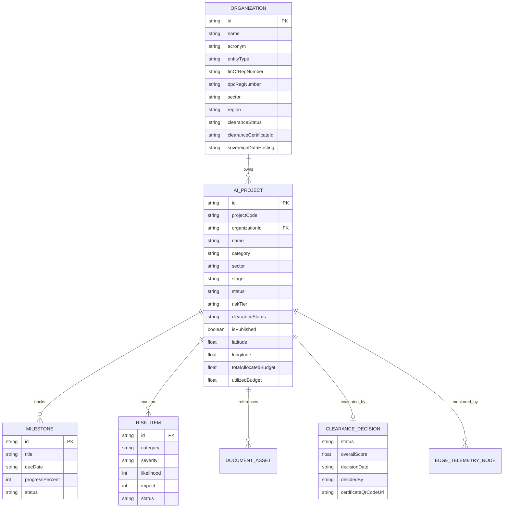

# National AI Project Tracking and Clearance System (NAPTCS)
# Comprehensive Database Schema & Entity Documentation

> **Document Version**: 2.5.0  
> **Status**: Verified against Codebase Commit `8e31aca`  
> **Primary Data Sources**: `src/data/sampleProjects.ts`, `src/api/gisSpatialApi.ts`  
> **Standards Compliance**: WGS 84 (EPSG:4326), PostGIS 3.4 Spatial Extensions, 3NF Relational Modeling

---

## 1. Database Architecture Overview

### Current Implementation (In-Memory Typed Store)

In the current production build, data is stored in-memory as strongly typed TypeScript data structures within [`src/data/sampleProjects.ts`](file:///c:/Users/N1TA/Ghana-AI-Project-Tracker-1/src/data/sampleProjects.ts). When users register organizations, submit projects, or update clearance statuses, modifications are made to the top-level React state within `src/App.tsx`.

* **Storage Engine**: Browser V8 JavaScript Memory Heap.
* **Persistence**: Ephemeral (survives client-side view navigation; resets on hard browser reload).
* **Referential Integrity**: Maintained by application business logic in React components and `src/api/gisSpatialApi.ts`.

### Target Architecture (PostgreSQL 16 + PostGIS + MongoDB)

The planned persistence architecture transitions the system to:
1. **PostgreSQL 16 with PostGIS 3.4**: For core relational entities, organization registrations, clearance workflow state machines, and spatial coordinates with `GIST` spatial indexes.
2. **MongoDB 7.0**: For large unstructured artifacts, complete Data Protection Impact Assessments (DPIA), automated bias audit logs, and high-frequency edge IoT telemetry buffers.

---

## 2. Entity-Relationship Diagram (ERD)

### ASCII ERD

```
+-----------------------------------+
|           ORGANIZATION            |
|-----------------------------------|
| PK  id                            |
|     name                          |
|     acronym                       |
|     entityType                    |
|     tinOrRegNumber                |
|     dpcRegNumber (Act 843)        |
|     sector                        |
|     region, district              |
|     dpoName, dpoEmail             |
|     clearanceStatus               | <---+
|     clearanceCertificateId        |     |
|     sovereignDataHosting          |     | 1:N Referential Link
+-----------------+-----------------+     | (Enforces Publication Gate)
                  |                       |
                  | 1:N                   |
                  v                       |
+-----------------------------------+     |
|             AI_PROJECT            |     |
|-----------------------------------|     |
| PK  id                            |     |
|     projectCode                   |     |
| FK  organizationId                |-----+
|     organizationName              |
|     name, description             |
|     category, sector              |
|     stage, status                 |
|     riskTier                      |
|     clearanceStatus               |
|     clearanceCertificateId        |
|     isOrganizationCleared         | (Computed / Denormalized)
|     isPublished                   | (Gate Invariant Result)
|     region, district              |
|     latitude, longitude           |
|     coordinates (GeoPoint)        |
+---+-------------+-------------+---+
    |             |             |
    | 1:N         | 1:N         | 1:N
    v             v             v
+-----------+ +-----------+ +-----------+
| MILESTONE | | RISK_ITEM | | DOC_ASSET |
|-----------| |-----------| |-----------|
| PK  id    | | PK  id    | | PK  id    |
| title     | | category  | | fileName  |
| dueDate   | | severity  | | fileType  |
| progress  | | likelihood| | version   |
| status    | | impact    | | signedBy  |
+-----------+ +-----------+ +-----------+
```

### Mermaid Diagram



---

## 3. Data Dictionary: Core Entities

### 3.1 Organization Entity (`Organization`)

Stores statutory profile, registration data, and clearance standing of every government MDA or private firm operating AI systems.

| Field Name | Type | Nullable | Description & Constraints |
| :--- | :--- | :--- | :--- |
| `id` | `string` | No | Primary Key. Format: `org-XXX` or UUID. |
| `name` | `string` | No | Legal institution name (e.g. `Ministry of Health`). |
| `acronym` | `string` | No | Official abbreviation (e.g. `MOH`, `UGMC`, `MTN`). |
| `entityType` | `EntitySectorType` | No | Enum: `'Government (MDA/MMDA/SOE)'`, `'Private Sector (Commercial Enterprise)'`, `'Private Sector (Startup/SME)'`, `'Academic & Research Institution'`, `'International Vendor / Partner'`. |
| `tinOrRegNumber` | `string` | No | Ghana Revenue Authority (GRA) Tax Identification Number or Registrar General Department code. |
| `dpcRegNumber` | `string` | No | Data Protection Commission Certificate number under Act 843. |
| `sector` | `string` | No | Enum: `'Health'`, `'Education'`, `'Agriculture'`, `'Finance'`, `'Security'`, `'Transport'`, `'Energy'`, `'Environment'`, `'Justice'`, `'Local Government'`. |
| `region` | `string` | No | Administrative region of headquarters (1 of 16 regions). |
| `district` | `string` | No | Metropolitan / Municipal / District Assembly name. |
| `dpoName` | `string` | No | Designated Data Protection Officer name (Mandatory under Act 843). |
| `dpoEmail` | `string` | No | DPO contact email. |
| `contactEmail` | `string` | No | General institutional email. |
| `website` | `string` | No | Public website URL. |
| `clearanceStatus` | `OrganizationClearanceStatus` | No | Enum: `'Cleared'`, `'Pending Review'`, `'Conditional'`, `'Not Cleared'`, `'Suspended'`. |
| `clearanceCertificateId` | `string` | Yes | Issued certificate identifier (e.g. `CERT-2026-NAPTCS-0001`). |
| `clearedDate` | `string` | Yes | ISO date certificate was ratified. |
| `expiryDate` | `string` | Yes | Accreditation expiry date (typically 12 months). |
| `reviewNotes` | `string` | Yes | Audit committee observations or conditional stipulations. |
| `submittedAt` | `string` | No | Timestamp registration application was submitted. |
| `sovereignDataHosting` | `string` | No | Data residency declaration: `'In-Country (National Data Centre)'`, `'Government-Approved Cloud'`, `'Hybrid Edge'`, `'Pending Verification'`. |

---

### 3.2 AI Project Entity (`AIProject`)

Central operational entity representing an individual AI model or platform deployment in the country.

| Field Name | Type | Nullable | Description & Constraints |
| :--- | :--- | :--- | :--- |
| `id` | `string` | No | Primary Key. Format: `proj-XXX` or UUID. |
| `projectCode` | `string` | No | Statutory tracking code (e.g. `GN-AI-2026-001`). |
| `name` | `string` | No | Full project title. |
| `category` | `string` | No | AI methodology (e.g. `Computer Vision`, `NLP`, `Predictive Analytics`). |
| `sector` | `string` | No | Primary sector of application. |
| `stage` | `string` | No | Lifecycle phase: `'Concept'`, `'Pilot'`, `'In Development'`, `'Production'`, `'Decommissioned'`. |
| `status` | `string` | No | Operational status: `'Active'`, `'Delayed'`, `'Review'`, `'Suspended'`. |
| `mda` | `string` | No | Lead supervising MDA / Sponsor Name. |
| `mdaCode` | `string` | No | Standard MDA code (e.g. `MCD-01`, `MOH-01`). |
| `organizationId` | `string` | No | Foreign Key -> `Organization.id`. |
| `organizationName` | `string` | No | Denormalized parent entity name. |
| `entitySectorType` | `string` | No | Sector category inherited from parent organization. |
| `riskTier` | `RiskTier` | No | Statutory risk tier: `'Minimal Risk'`, `'Limited Risk'`, `'High Risk'`, `'Prohibited'`. |
| `clearanceStatus` | `ProjectClearanceStatus` | No | Project-level clearance: `'Cleared'`, `'Conditional'`, `'Pending Review'`, `'Not Cleared'`, `'Draft'`. |
| `clearanceCertificateId` | `string` | Yes | Certificate tracking number if cleared. |
| `isOrganizationCleared` | `boolean` | No | Boolean flag indicating whether parent org is currently cleared. |
| `isPublished` | `boolean` | No | **Gatekeeper Field**. Calculated as `isOrganizationCleared && (clearanceStatus === 'Cleared' || 'Conditional')`. |
| `region` | `string` | No | Primary operational administrative region. |
| `district` | `string` | No | Operating district. |
| `latitude` | `number` | No | Geographic latitude (WGS 84, $4.70 \le \text{lat} \le 11.20$). |
| `longitude` | `number` | No | Geographic longitude (WGS 84, $-3.30 \le \text{lng} \le 1.30$). |
| `totalAllocatedBudget`| `number` | No | Total budget in GHS. |
| `utilizedBudget` | `number` | No | Disbursed and spent budget in GHS. |
| `currency` | `string` | No | Primary accounting currency (`'GHS'`). |
| `complianceGrade` | `string` | No | Ethics audit grade: `'Excellent'`, `'Good'`, `'Moderate'`, `'High Risk'`. |
| `readinessScore` | `number` | No | Technical readiness index (0 - 100). |
| `sovereignBorderVerified` | `boolean` | No | True if coordinate is verified inside Ghana borders. |
| `activeSensorsCount` | `number` | No | Count of linked IoT edge telemetry nodes. |

---

### 3.3 Embedded & Supporting Data Structures

#### Budget Sub-Object (`Budget`)

```typescript
export interface Budget {
  totalAllocated: number;
  disbursed: number;
  utilized: number;
  remaining: number;
  primaryFundingSource: 'Government' | 'Development Partners' | 'Donors' | 'Private Sector' | 'Research Grants';
  currency: 'GHS' | 'USD';
}
```

#### Ethics & Compliance Scorecard (`ComplianceScore`)

```typescript
export interface ComplianceScore {
  fairness: number;         // Score 0 - 100
  transparency: number;     // Score 0 - 100
  accountability: number;   // Score 0 - 100
  privacy: number;          // Score 0 - 100
  security: number;         // Score 0 - 100
  overallGrade: 'Excellent' | 'Good' | 'Moderate' | 'High Risk';
}
```

#### Risk Registry Item (`RiskItem`)

```typescript
export interface RiskItem {
  id: string;
  category: string;
  severity: 'Low' | 'Medium' | 'High' | 'Critical';
  likelihood: number;       // 1 - 5 Scale
  impact: number;           // 1 - 5 Scale
  description: string;
  mitigationPlan: string;
  status: 'Open' | 'Mitigated' | 'Escalated';
}
```

---

## 4. Production PostGIS SQL DDL Migration Blueprint

When provisioning the PostgreSQL production database, execute the following SQL migration script:

```sql
-- ============================================================================
-- Ghana National AI Projects Registry & Monitoring System (GNAPRMS / NAPTCS)
-- PostgreSQL 16 + PostGIS 3.4 Sovereign Database Migration Script
-- ============================================================================

-- 1. Enable PostGIS Spatial and UUID Extensions
CREATE EXTENSION IF NOT EXISTS "uuid-ossp";
CREATE EXTENSION IF NOT EXISTS "postgis";

-- 2. Organizations Table
CREATE TYPE entity_sector_type AS ENUM (
    'Government (MDA/MMDA/SOE)',
    'Private Sector (Commercial Enterprise)',
    'Private Sector (Startup/SME)',
    'Academic & Research Institution',
    'International Vendor / Partner'
);

CREATE TYPE clearance_status_type AS ENUM (
    'Cleared',
    'Pending Review',
    'Conditional',
    'Not Cleared',
    'Suspended'
);

CREATE TABLE organizations (
    id VARCHAR(64) PRIMARY KEY,
    name VARCHAR(255) NOT NULL,
    acronym VARCHAR(32) NOT NULL,
    entity_type entity_sector_type NOT NULL,
    tin_or_reg_number VARCHAR(64) NOT NULL UNIQUE,
    dpc_reg_number VARCHAR(64) NOT NULL,
    sector VARCHAR(64) NOT NULL,
    region VARCHAR(64) NOT NULL,
    district VARCHAR(128) NOT NULL,
    dpo_name VARCHAR(128) NOT NULL,
    dpo_email VARCHAR(255) NOT NULL,
    contact_email VARCHAR(255) NOT NULL,
    website VARCHAR(255),
    clearance_status clearance_status_type NOT NULL DEFAULT 'Pending Review',
    clearance_certificate_id VARCHAR(64),
    cleared_date TIMESTAMPTZ,
    expiry_date TIMESTAMPTZ,
    review_notes TEXT,
    sovereign_data_hosting VARCHAR(128) NOT NULL DEFAULT 'In-Country (National Data Centre)',
    submitted_at TIMESTAMPTZ NOT NULL DEFAULT NOW(),
    created_at TIMESTAMPTZ NOT NULL DEFAULT NOW(),
    updated_at TIMESTAMPTZ NOT NULL DEFAULT NOW()
);

-- 3. AI Projects Table
CREATE TYPE risk_tier_type AS ENUM (
    'Minimal Risk',
    'Limited Risk',
    'High Risk',
    'Prohibited'
);

CREATE TABLE ai_projects (
    id VARCHAR(64) PRIMARY KEY,
    project_code VARCHAR(32) NOT NULL UNIQUE,
    organization_id VARCHAR(64) NOT NULL REFERENCES organizations(id) ON DELETE RESTRICT,
    name VARCHAR(255) NOT NULL,
    description TEXT NOT NULL,
    category VARCHAR(128) NOT NULL,
    sector VARCHAR(64) NOT NULL,
    stage VARCHAR(32) NOT NULL DEFAULT 'Pilot',
    status VARCHAR(32) NOT NULL DEFAULT 'Active',
    mda VARCHAR(255) NOT NULL,
    mda_code VARCHAR(32) NOT NULL,
    risk_tier risk_tier_type NOT NULL DEFAULT 'Limited Risk',
    clearance_status clearance_status_type NOT NULL DEFAULT 'Pending Review',
    clearance_certificate_id VARCHAR(64),
    region VARCHAR(64) NOT NULL,
    district VARCHAR(128) NOT NULL,
    latitude DOUBLE PRECISION NOT NULL,
    longitude DOUBLE PRECISION NOT NULL,
    -- PostGIS spatial geography point column (WGS 84 EPSG:4326)
    geom GEOGRAPHY(Point, 4326) NOT NULL,
    total_allocated_budget NUMERIC(14, 2) NOT NULL DEFAULT 0.00,
    utilized_budget NUMERIC(14, 2) NOT NULL DEFAULT 0.00,
    currency VARCHAR(8) NOT NULL DEFAULT 'GHS',
    compliance_grade VARCHAR(32) NOT NULL DEFAULT 'Good',
    readiness_score INT NOT NULL DEFAULT 70 CHECK (readiness_score BETWEEN 0 AND 100),
    sovereign_border_verified BOOLEAN NOT NULL DEFAULT TRUE,
    is_published BOOLEAN NOT NULL DEFAULT FALSE,
    created_at TIMESTAMPTZ NOT NULL DEFAULT NOW(),
    updated_at TIMESTAMPTZ NOT NULL DEFAULT NOW()
);

-- 4. Spatial Indexes and Optimization
CREATE INDEX idx_ai_projects_geom ON ai_projects USING GIST (geom);
CREATE INDEX idx_ai_projects_sector ON ai_projects (sector);
CREATE INDEX idx_ai_projects_clearance ON ai_projects (clearance_status);
CREATE INDEX idx_ai_projects_org ON ai_projects (organization_id);

-- 5. Gatekeeper Trigger: Automatically update is_published based on statutory invariant
CREATE OR REPLACE FUNCTION enforce_sovereign_clearance_gate()
RETURNS TRIGGER AS $$
DECLARE
    org_status clearance_status_type;
BEGIN
    SELECT clearance_status INTO org_status FROM organizations WHERE id = NEW.organization_id;
    
    IF (org_status IN ('Cleared', 'Conditional')) AND (NEW.clearance_status IN ('Cleared', 'Conditional')) THEN
        NEW.is_published := TRUE;
    ELSE
        NEW.is_published := FALSE;
    END IF;
    
    -- Automatically set PostGIS spatial geometry from lat/lng coordinates
    NEW.geom := ST_SetSRID(ST_MakePoint(NEW.longitude, NEW.latitude), 4326)::geography;
    
    RETURN NEW;
END;
$$ LANGUAGE plpgsql;

CREATE TRIGGER trg_ai_projects_gatekeeper
BEFORE INSERT OR UPDATE ON ai_projects
FOR EACH ROW
EXECUTE FUNCTION enforce_sovereign_clearance_gate();
```

---

## 5. Seed Data Summary

The in-memory database contains 18 initial organizations and 18 corresponding AI projects across Ghana:

* **Sovereign Sectors**: Health (4), Agriculture (3), Transport (2), Finance (2), Security (2), Education (2), Environment (2), Justice (1).
* **Sample Entities**:
  * Ministry of Communications and Digitalisation (`MCD`)
  * National Identification Authority (`NIA`)
  * Ghana Cocoa Board (`COCOBOD`)
  * Korle Bu Teaching Hospital / UGMC (`MOH`)
  * Bank of Ghana Fintech & Innovation Office (`BOG`)
  * Ghana Revenue Authority (`GRA`)
  * mPedigree Network (Private Sector Health)
  * Farmerline Ghana Ltd (Private Sector Agritech)
  * Zeepay Ghana (Private Sector FinTech)
